# Image clustering

## My Goal is to create clusters which visually, in terms of visual language and style of all images would also be classified into clusters by a human.

#### Final Iteration 1

I kept trying to create clusters in which only visually similiar images would be clustered in. This attempt failed when viewed on the whole body of images per clusters. However I was able to find some interesting juxtapositions within the differennt clusters:  
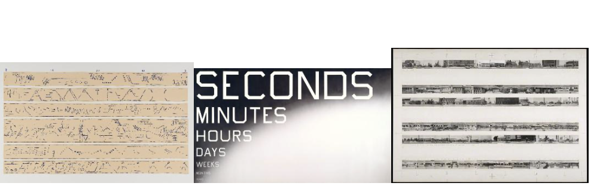
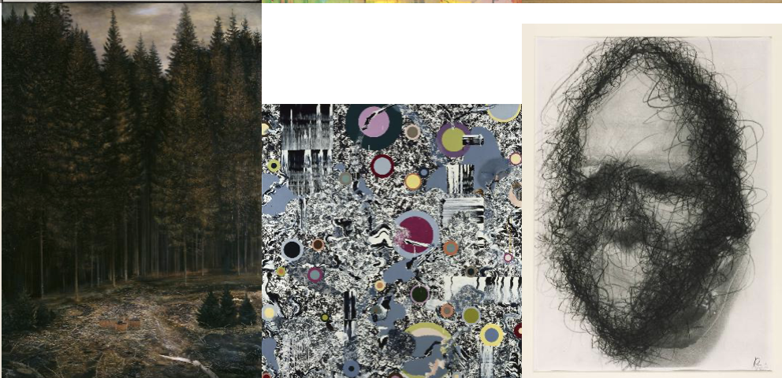
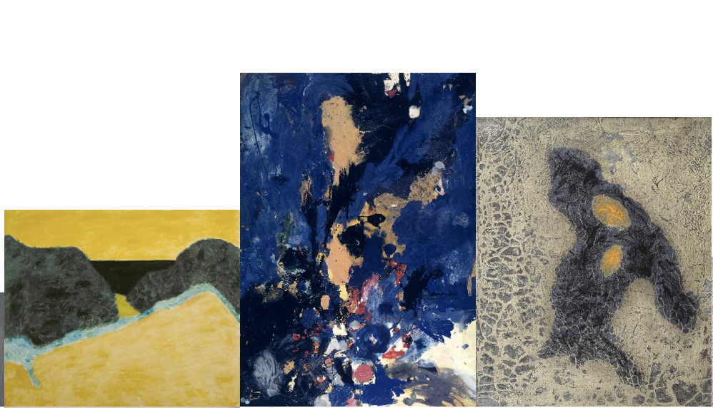
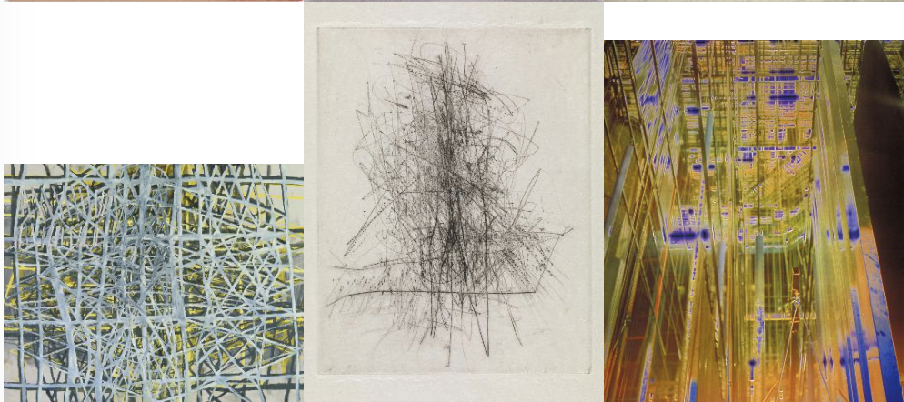

### Final representation first iteration
Final Clusters:  
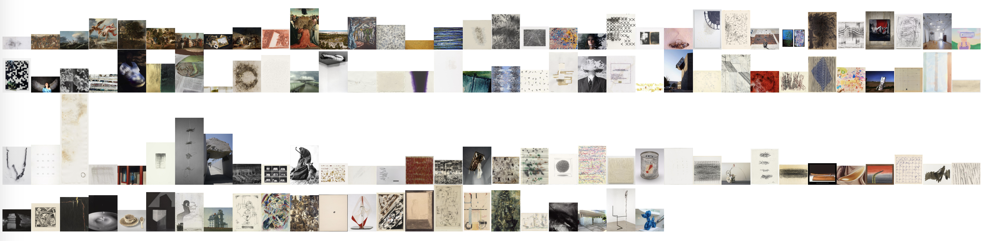
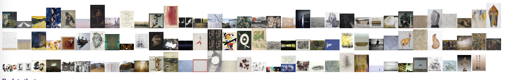
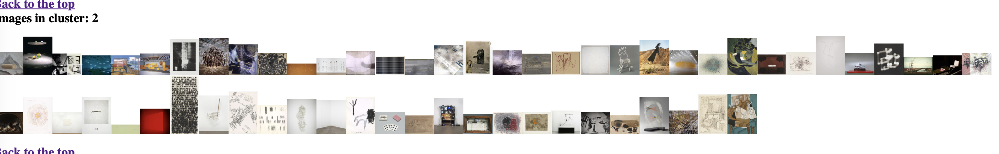
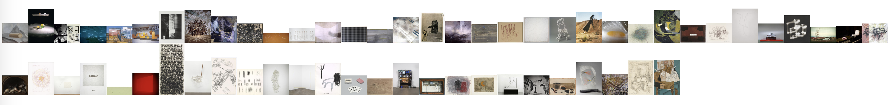

#### Iteration 1

As a first attempt I encoded the values of "primary_medium" into machine readable values. I also did this with the "country of origin" but decided not to use this feature, as it does not have an impact on the style of images.  

For my first iteration I use the features primary_medium, color, texture, black and white value, and shape. 
The intertia plot by number of clusters shows distinct cluster from numbers 1-6.  
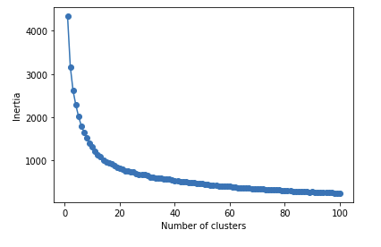  
I therefore decided  to have a closer look on the cluster numbers of 4,8,12,15 and 20.  
For this first iteration I then decided to organize them in 4 clusters, as the silhouette analysis had less outliers in the clusters, although there still are a few.   
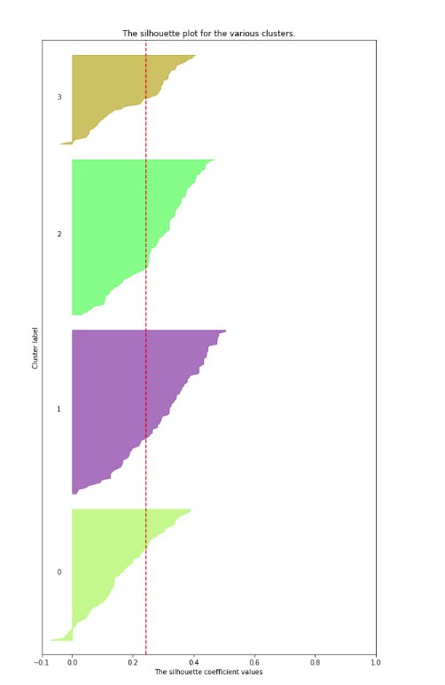  
For comparison reasons also attached is the silhouette plot for 8 clusters.  

### Final representation first iteration
There is already visual similiarities between some images per cluster. My goal however is to make this visual similiarity even bigger.
Selection of first two rows of images per cluster  
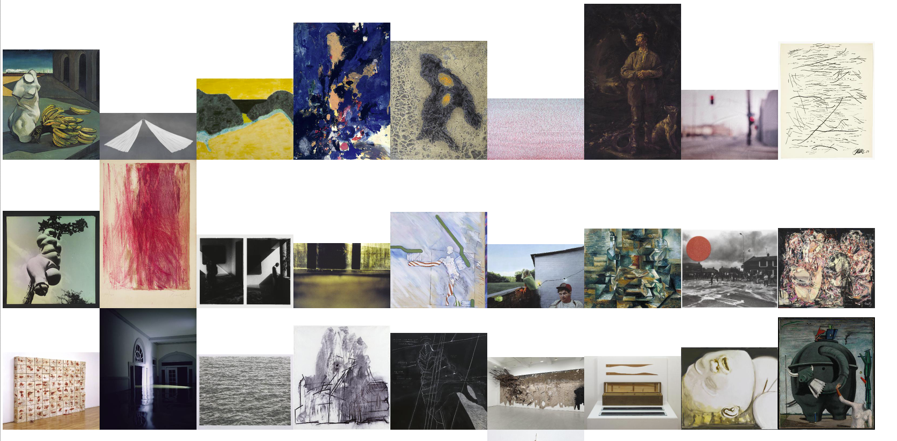
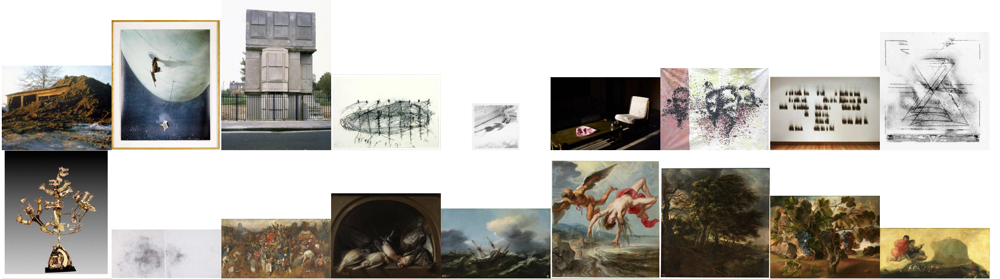
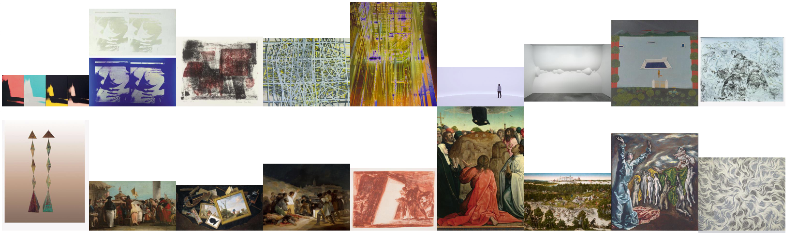
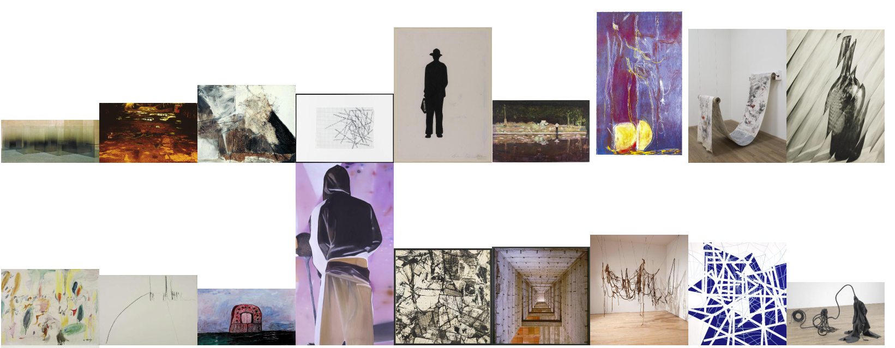

